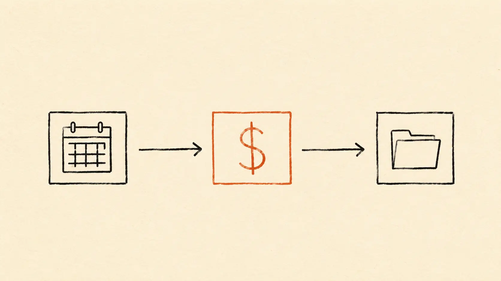
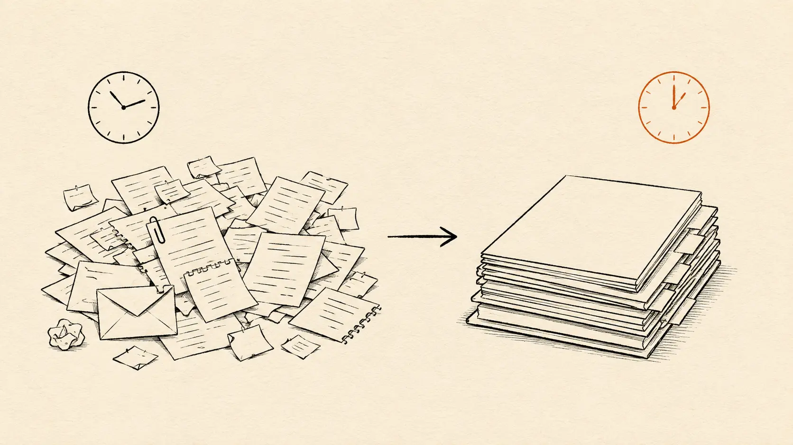

Most solo businesses lose clients in the gap between "interested" and "signed." A potential client sends an enthusiastic email. You reply with a calendar link. They book a call three days later. You take the call and it goes well. You promise to send a proposal. The proposal goes out two days after that. They sit on it for a week. The momentum is gone. They write back: *"Hey, sorry — we ended up going with someone else who could start sooner."*

That sequence has cost me actual money. The fix isn't working harder — it's removing friction between every step. If a client can go from inquiry → call booked → deposit paid → kickoff scheduled → project folder created in under 24 hours without me touching anything, the close rate doubles.

This is the exact 3-tool stack I use to make that happen. **Calendly + Stripe + Notion**, glued together with a tiny bit of automation. Free to start, $10–25/month to scale, set up in one focused afternoon.

## The stack at a glance

- **Calendly** handles the scheduling: a single booking link that knows your availability.
- **Stripe** handles the deposit: a payment link the client uses before the call is confirmed.
- **Notion** handles the records: every client gets a project page auto-created from a template.
- **Make.com** (optional) glues them together into a single flow that runs in the background.

**Free-tier viability:**
- Calendly Free: ✅ enough for 1 event type
- Stripe: ✅ no monthly fee, pays per transaction
- Notion Free: ✅ unlimited blocks for individuals
- Make Free: ✅ 1,000 credits/month covers the onboarding scenario easily

So you can run the entire system for $0/month while you validate it. The paid upgrades happen later, only if you hit a real ceiling.

## Step 1: The Calendly booking page (15 minutes)

This is your single point of entry for prospect calls. Don't have multiple meeting types yet — the free tier limits you to 1 event type, and the discipline is actually useful.

**Setup:**
1. Sign up at [calendly.com](https://calendly.com) → choose the Free plan
2. Connect your Google or Microsoft calendar (so Calendly knows when you're busy)
3. Create your event type:
   - **Name:** "Discovery Call"
   - **Duration:** 30 minutes (don't make it 60 — most discovery calls become time-wasters at 60)
   - **Buffer time:** 15 minutes before and after (prevents back-to-back fatigue)
   - **Daily limit:** 3 (forces you to maintain capacity for real work)
   - **Minimum scheduling notice:** 24 hours (prevents "can we hop on in an hour?" requests)
4. **Booking page questions** — add 3 fields:
   - "What kind of project are you considering?"
   - "What's your rough timeline?"
   - "What's your budget range?" (qualifying question — most solo operators are afraid to ask, then waste calls with unqualified leads)
5. Customize your booking link URL: `calendly.com/yourname/discovery`

**Why this matters:** The booking link goes in every email signature, every social profile, every reply to an inquiry. The prospect picks a time without back-and-forth. The qualifying questions filter time-wasters before the call.

## Step 2: Stripe payment link for the deposit (10 minutes)

Most solo discovery calls are free. A small percentage of solo operators ask for a refundable deposit before discovery — usually the wrong move unless you're charging premium rates.

The Stripe integration matters more for **deposits on actual project starts** — after the discovery call, when the client says "yes, let's do this," they pay a deposit before you do any work. This is where Stripe earns its keep.

**Setup:**
1. Sign up at [stripe.com](https://stripe.com) (no monthly fee — pays 2.9% + 30¢ per US transaction)
2. Verify your business (sole proprietor is fine) and connect your bank account
3. Dashboard → Products → **Add product** → "Project Deposit"
4. Set the deposit amount based on your typical project: 25–50% of total fee, minimum $500
5. **Create a payment link** → copy the URL (looks like `buy.stripe.com/abcXYZ123`)
6. Save this URL — it goes into your post-discovery-call email template

**Why this matters:** A paid deposit kills the "ghosted between discovery and start" failure mode. People who pay $500–$2,000 don't disappear. People who didn't pay anything will.

## Step 3: The Notion client database template (20 minutes)

This is where every client's information lives, from inquiry through delivery. The setup once → use forever pattern at its finest.

**Setup:**
1. Sign up at [notion.so](https://notion.so) → choose the Free plan (individual, no team)
2. Create a top-level page called "Clients"
3. Inside Clients, add a **Database** → "Client Roster"
4. Add these properties to the database:
   - Title: Client Name
   - Status: select with options `Lead`, `Discovery`, `Proposal`, `Active`, `Wrapped`
   - Date: Discovery Call Date
   - Number: Deposit Amount
   - Date: Project Start
   - Date: Project End
   - URL: Project Folder (Google Drive link)
   - Text: Discovery Notes
   - Multi-select: Tags (e.g. "B2B SaaS", "E-commerce", "Agency")

5. Create a **template** for each new client row → click the dropdown on "+ New" → "+ New template" → name it "Standard Client"
6. Inside the template, add a series of subpages:
   - **Discovery notes** (where you capture the call notes)
   - **Proposal** (linked Google Doc or Notion page)
   - **Project brief** (final brief once they sign)
   - **Deliverables log** (running list of what's been shipped)
   - **Invoices** (database of invoices sent + paid)
   - **Communication log** (running notes on important client conversations)

7. Now switch to **Board view** on the Client Roster → group by Status. You now see your pipeline at a glance: Leads on the left, Wrapped on the right.

**Why this matters:** Every client interaction has a home. You stop hunting "where did I save the kickoff notes for Acme?" because they're always in the same place, in the same structure, for every client.

## Step 4: The handshake automation (Make.com, 30 minutes)

This is the magic. When someone books a discovery call via Calendly, Make.com automatically:

1. Creates a new row in your Notion "Client Roster" database with their name and call date
2. Sends them a personalized welcome email with prep questions
3. Adds a kickoff-prep task to your to-do list (ClickUp, Todoist, whatever you use)
4. (After the call, when you move them to "Proposal" status) auto-creates a Google Drive folder with their name

**Setup:**
1. Sign up at [Make.com free](https://www.make.com/en/register?pc=toolbase)
2. Create a new scenario
3. **Trigger:** Calendly → "Watch invitee created"
4. **Module 1:** Notion → "Create a database item" → map fields from Calendly to your Client Roster
5. **Module 2:** Gmail → "Send an email" → templated welcome email with prep questions
6. **Module 3:** ClickUp (or Todoist) → "Create a task" → "Prep for {Client Name} discovery call"
7. Test the scenario by booking a fake discovery call on yourself
8. Once it works, activate the scenario

**Credit cost:** ~6 credits per booking × maybe 10 bookings/month = 60 credits. Tiny fraction of Make's free tier (1,000 credits/month).

This single automation eliminates the manual "now I have to set up everything for this prospect" work after every Calendly notification.

[Sign up free at Make.com →](https://www.make.com/en/register?pc=toolbase)

## The complete client journey, end to end

Here's what happens when a prospect lands on your website and ends up as an active project — with no manual work from you between steps:

1. **Prospect emails:** "I'd love to chat about a project."
2. **You reply** with your Calendly link and one sentence: "Pick any time that works — looking forward."
3. **They book** a discovery call. Calendly auto-confirms with calendar invites for both sides.
4. **Make.com fires:**
   - Their record is created in your Notion Client Roster with status `Discovery`
   - They get a personalized welcome email with prep questions for the call
   - You get a ClickUp task: "Prep for {their name} discovery call"
5. **You take the call.** Notes go directly into the Discovery Notes page inside their Notion record.
6. **After the call,** you move their status to `Proposal` in Notion. The proposal is a linked Google Doc inside their record.
7. **They accept.** You send them the Stripe payment link for the deposit.
8. **They pay.** Stripe sends you the notification. You move their status to `Active` in Notion.
9. **You schedule the kickoff** via Calendly, paste the Google Drive folder link into their Notion record, and the actual project begins.

Elapsed time on YOUR side: ~2 hours of focused work across the whole journey (the discovery call + the post-call write-up + the actual project start). Elapsed wall-clock time from "they email" to "they're an active client": as little as 48 hours.

Without this system, the same journey easily takes 7–10 days of back-and-forth, and a chunk of clients drop out along the way because of the friction.

## What to skip until you actually need it

Don't add these to the system until they solve a problem you've actually had:

- **Contract automation tools** (Bonsai, HelloSign, etc.) — start by attaching a contract PDF to your proposal Google Doc. Add a contract tool later if you sign 4+ clients per month.
- **CRM upgrades** (HubSpot, Pipedrive) — the Notion Client Roster IS your CRM at solo scale. You don't need a separate one.
- **Project management software upgrades** — the Notion record + a simple ClickUp task list per client is enough. We covered the [ClickUp solo setup separately](/blog/clickup-for-solo-project-management-2026/).
- **Email sequence tools** (ActiveCampaign, ConvertKit drip flows) — the Gmail send inside Make is enough until you have 5+ canned email sequences. By then a real ESP is worth the upgrade.

## The bigger point

Solo client onboarding fails almost entirely because of friction, not because of skill. Every manual step between "they're interested" and "they're paying you" is an opportunity for them to lose momentum, get distracted, or sign with someone faster.

The stack above isn't about saving you time (though it does). It's about **keeping the client's momentum alive** during the most fragile period of the relationship. People who book a call and get an instant welcome email feel like they're working with a professional. People who book and hear nothing for 18 hours start second-guessing.

You can build this entire system in one afternoon for $0. The first time it captures a client you would have otherwise lost to friction, it pays itself back forever.

---

*This post contains affiliate links. We only recommend tools we'd use ourselves — Make.com is what I run my own onboarding automation on.*
