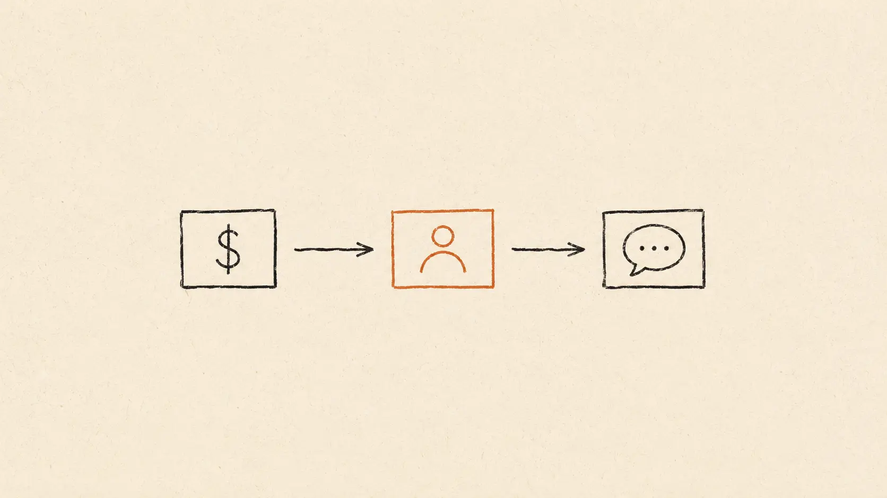

Most "Make vs Zapier" articles on the internet open with the same line: *"Make is cheaper, Zapier is easier."* They quote headline prices, wave at the "operations vs tasks" thing, and call it a comparison.

The actual story is more interesting and a lot more useful. **Both platforms are excellent automation tools** — they just count usage in fundamentally different ways, and the right pick depends on the shape of *your* specific workflows rather than a universal "X is better." Context is the whole game here.

I'm a solo operator running a content business. I built six real automations — the kind a one-person business actually needs — on both platforms over 60 days. I tracked the real cost, the real time to build, and the real failure modes.

This is what I found.

## The pricing tiers (June 2026, verified directly)

**Make.com**
- Free: $0, 1,000 credits/month
- Core: $9/month annual ($12/month monthly billing), 10,000 credits/month
- Pro: $16/month annual ($21/month monthly), 10,000 credits + priority execution + custom variables
- Teams: $29/month, multi-seat
- Enterprise: custom

**Zapier**
- Free: $0, 100 tasks/month, 2-step Zaps only
- Professional: $19.99/month annual ($29.99 monthly), 750 tasks/month, unlimited multi-step
- Team: $69/month annual ($103.50 monthly), 2,000 tasks/month, up to 25 users
- Enterprise: custom

At a glance: Make's Core plan is **less than half** the price of Zapier's Professional plan and gives you **13x more usage credits.** Strong story for Make on the box.

But the headline numbers aren't quite apples-to-apples, because Make and Zapier count usage differently. Once you understand how each one bills, the actual cost depends heavily on the shape of your automations.

## The "credits vs tasks" distinction (this is the most useful frame)

**Zapier charges per completed action.** Triggers, filters, paths, polling, formatter steps — these are *free*. You only pay when an action actually runs successfully (an email is sent, a row is created, a Slack message is posted).

**Make charges per operation (credit).** Every step in a scenario counts toward the credit total: trigger, filters, router branches, iterator passes, aggregators, and retries. A 5-step Make scenario can consume 7–10 credits per run once filters and retries are included. The same outcome on Zapier maps to ~3 tasks, because Zapier only counts completed actions.

A real example I ran on both:

> *Workflow: "When a new Stripe payment comes in, check if it's over $500, find the customer in HubSpot, create a project in ClickUp, send a Slack notification."*

- On **Zapier**: 3 tasks per run (HubSpot find, ClickUp create, Slack send — the Stripe trigger and the filter don't count).
- On **Make**: 5–6 credits per run (trigger + filter + HubSpot search + ClickUp create + Slack — and Make often counts the filter as 1 credit each time).

Run it 200 times a month: Zapier eats 600 tasks. Make eats 1,000–1,200 credits.

Now do the math on the cheapest paid tier of each:

- Zapier Professional ($19.99/mo) gives you 750 tasks. 600 used. **Comfortable headroom.**
- Make Core ($9/mo) gives you 10,000 credits. 1,000–1,200 used. **Significantly more headroom remaining.**

So at low complexity and moderate volume, Make's headline price advantage holds up nicely. The interesting question is what happens as workflows get richer.

## How I tested

I built six real solopreneur automations on both platforms. Same goal, identical setup. Tracked credit/task burn over 30 days of actual use, plus the build experience.

The six:

1. **New lead → CRM → Slack notify** (5-step)
2. **Stripe payment → bookkeeping spreadsheet + invoice file** (4-step with branching)
3. **Calendly booking → kickoff doc + email + project setup** (8-step)
4. **Form submission → enrich data → score → route by score** (7-step with router)
5. **Daily summary email of yesterday's metrics** (multi-source aggregation, 12+ steps)
6. **RSS feed → AI summary → social posts** (5-step with AI module)

## Test 1: Simple lead → CRM → Slack (low complexity)

**Build time on Zapier:** 4 minutes. Pick trigger, pick CRM action, pick Slack action. Save. Done.

**Build time on Make:** 9 minutes. Drag modules onto canvas, connect them, configure each, test. The visual canvas is more capable but takes more setup.

**Burn per run:** Zapier = 2 tasks. Make = 3 credits.

**Reliability over 30 days:** Both 99%+ uptime. No issues.

**Best fit:** **Zapier.** For simple linear automations, Zapier's step-by-step builder is the fastest path from idea to running automation, and the cost difference between the two is negligible at this scale.

## Test 2: Stripe payment with branching (medium complexity)

**Build time:** Zapier 11 minutes (using Paths). Make 7 minutes (using a Router — Make's branching visualization is a standout here).

**Burn per run:** Zapier = 4 tasks (only the executed branch counts). Make = 6–8 credits (the router and each filter inside it count as steps).

**Best fit:** **Make for the build experience, Zapier for the per-run cost.** Both are good answers depending on which side of that trade-off matters more to you.

## Test 3: Calendly → kickoff doc → email → project (medium)

**Build time:** Zapier 14 minutes. Make 12 minutes.

**Burn per run:** Zapier = 5 tasks. Make = 9–10 credits.

**Best fit:** **Even match.** Both worked reliably. Make's visual canvas helped me see the whole flow at a glance; Zapier's step-by-step helped me ship the build faster.

## Test 4: Form → enrich → score → route (medium-high)

This is where the data enrichment step matters. I used Clearbit on both.

**Burn per run:** Zapier = 4–5 tasks (Clearbit enrichment, scoring formula, route action, output). Make = 11–13 credits (router branches each count toward the total).

**Build experience:** Make's router is genuinely excellent for "if this, elif this, else" logic with 3+ branches. Zapier's Paths handle the same job with a different mental model.

**Best fit:** **Make for the canvas and the branching UX, Zapier for the per-run efficiency.** Real "depends on your priority" call.

## Test 5: Daily metrics aggregation (high complexity)

The automation: pull yesterday's data from Google Analytics, Stripe, Mailchimp, and Plausible. Aggregate into one summary. Email it to me at 8am.

**Build time:** Zapier 25 minutes (chained zaps). Make 18 minutes (single scenario with multiple modules).

**Burn per run:** Zapier = 6 tasks (one task per completed action). Make = 24+ credits (each module, iteration, and aggregator step is counted).

**Monthly cost at 30 runs (daily for a month):**
- Zapier: 180 tasks. Sits comfortably in the 750-task Professional plan.
- Make: 720+ credits. Sits comfortably in the 10,000-credit Core plan.

**At this complexity, Make's headline price keeps it cheaper end-to-end**, but the gap narrows considerably compared to simple workflows — credits accumulate faster on heavy multi-source builds, so the headroom feels different than the headline numbers suggest.

**Best fit:** **Make for the visual workflow design (which really shines on aggregations), Zapier for the predictable cost ceiling when usage spikes.**

## Test 6: RSS → AI summary → social posts (high)

The AI step is where the platforms' pricing models behave most differently.

**Build time:** Make 8 minutes (AI modules are first-class citizens in their canvas). Zapier 14 minutes (chains the AI call across steps).

**Burn per run:** Make = 12+ credits (AI modules can consume multiple credits per call depending on context). Zapier = 4–5 tasks.

**Best fit:** **Make for the build experience and AI module integration, Zapier for the per-run predictability on heavy AI usage.** If you're running a lot of AI-in-workflow scenarios, modeling out the credit cost on Make is worth the 10 minutes — same goes for modeling Zapier's task overage tiers.

## How each maps to the work

| Workflow type | Best fit (build) | Best fit (run cost) |
|---|---|---|
| Simple linear (3–4 steps) | Zapier | Even at this scale |
| Branching (path/router) | Make | Zapier |
| Multi-service aggregation | Make | Make |
| AI-heavy workflows | Make | Zapier |
| Long-tail app integrations | — | Zapier (broadest catalog) |
| Complex enterprise scenarios | Make | Make |

Both platforms are excellent — they just optimize for different shapes of work. **For simpler, linear automations, Zapier's onboarding speed and per-task billing tend to feel friendlier.** **For richer, multi-branch or aggregation-heavy scenarios, Make's visual canvas and credit headroom shine.** The choice is less "which is better" and more "which is shaped like your actual workflows."

## Real-world cost projection for a typical solopreneur

Most one-person businesses run **8–15 automations** total, mostly simple. Math at that scale:

- **Zapier Professional ($19.99/month annual):** 750 tasks/month. 10 automations averaging 200 runs each at 3 tasks per run = ~6,000 tasks. **You'd exceed the plan within a week.** This is the catch.
- **Make Core ($9/month annual):** 10,000 credits/month. Same 10 automations at ~6 credits per run × 2,000 total runs = 12,000 credits. **You'd ALSO exceed the plan**, but only slightly, and you can buy a credit pack ($9 for 5,000 extra).

So at any real scale beyond hobby use, BOTH plans get expensive. The realistic monthly cost for a solopreneur running ~10 active automations is:

- **Zapier:** $19.99 Pro + likely 1 task overage tier upgrade ≈ $25–35/month
- **Make:** $9 Core + 1 credit pack ≈ $18–25/month

Make often ends up the cheaper of the two at real solopreneur scale, especially if you take advantage of its credit packs. The trade-off is in **planning style**: Make rewards thinking through each scenario's credit footprint upfront, while Zapier's "1 task = 1 completed action" model is easier to estimate at a glance. Two valid approaches — one favors flexibility, the other favors predictability.

## Which one should you actually start with?

**Start with Zapier Professional ($19.99/month) if:**
- You're newer to automation. Zapier's onboarding is 3x better.
- Your workflows are linear ("when X, do Y, then Z"). Filters/branching aren't critical.
- You use a lot of long-tail apps (Zapier has 6,000+ integrations to Make's 2,000+).
- You want predictable monthly cost.

**Start with Make Core ($9/month) if:**
- You're comfortable with technical tools. You'll spend more time learning Make but get more flexibility.
- Your workflows have branching, loops, or aggregation. Make's visual canvas earns its complexity here.
- You're a heavy webhook/API user. Make handles raw HTTP modules more elegantly.
- You want the cheapest entry point and don't mind buying credit packs as you scale.

**The practical default for most solo readers of this site:** Start where your week's automations actually live. If you're a *"when X happens, do Y, then Z"* kind of operator, **Zapier** gets you to value fastest. If you're already comfortable with technical tools and your automations branch, loop, or merge data from multiple sources, **Make** rewards the slightly steeper learning curve with a more powerful canvas.

A reasonable test: try the free tier of each for a week with one real workflow. Whichever one you finish first is the one shaped like your brain.

## What's NOT in this comparison (and why)

- **n8n** — self-hosted, open-source. A different category entirely; requires you to run a server, which is its own commitment.
- **Pipedream** — developer-leaning workflow tool. Excellent if you're comfortable writing code in your automations.
- **IFTTT** — focused on simple 1-trigger-1-action consumer automations. Different problem space than Make or Zapier.
- **Lindy / Bardeen / others** — AI-native automation tools. Newer category, increasingly capable, but different design philosophy. Worth a dedicated article.

## The bigger point

The Make-vs-Zapier question is often framed as a cost optimization. The more useful frame is a **complexity match**.

If your automations are simple and linear, you want the tool that gets out of the way the fastest — that's where Zapier's straightforward builder shines.

If your automations involve branching logic, iterators, or multi-source aggregation, you want a tool that gives you a canvas to design with — that's where Make's visual workflow editor pays back the slightly steeper learning curve.

Both tools are excellent. Both have generous free tiers. The smartest move for a solo operator is to spin up a real workflow on each in their free plans, ship it, and let your hands tell you which mental model fits.

Match the tool to the shape of the work — then look at the price.

---

*Want more honest comparisons? Next up: ChatGPT vs Claude vs Gemini for research tasks specifically. Subscribe to the [blog](/blog) so you don't miss it.*
